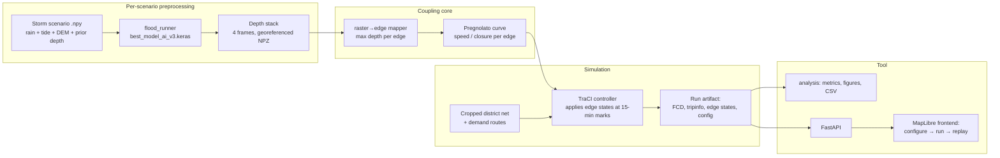

# Flood-Traffic Digital Twin — Project Plan

Couples the CNN-LSTM urban flood forecasting model (`../CNN-LSTM-Flood-Forecasting`)
with microscopic traffic simulation (Eclipse SUMO, building on `../sumo_norfolk`) to
quantify how forecast flooding disrupts traffic in a Norfolk, VA district — and how
much traveler information (rerouting) mitigates it.

**Deliverable:** mentorship research output (paper section / report with UVA-ODU
collaborators). First-class outputs are exportable metrics and figures; the web app
is the exploration tool that produces them.

> **Executing agents:** read [IMPLEMENTATION_CONTEXT.md](IMPLEMENTATION_CONTEXT.md)
> before touching anything — it holds the verified paths, data contracts, known traps
> (stale paths, checkpoint-loading mismatch), and the facts still marked UNCONFIRMED.

---

## 1. Fixed decisions

These were resolved deliberately; don't relitigate casually. Each lists its rationale.

| # | Decision | Choice | Rationale |
|---|----------|--------|-----------|
| D1 | Study area | Crop SUMO net to a ~2–3 km district around the flood model domain (Hampton Blvd / Colley Ave / ODU area) | Flood model is only valid on its 320 m × 320 m training domain; a district this size gives real detour corridors while keeping all flooding inside the modeled hazard zone. Metro-scale demand calibration avoided. |
| D2 | Flood inference | Offline, one-shot per scenario. CLI runs the trained `.keras` model on a chosen storm input (`.npy`), writes a georeferenced 4-frame depth stack. | Deterministic, reproducible, zero service infra. 60-min forecast horizon (t+15/30/45/60) matches a 1-hour SUMO run exactly. **Upgrade flag:** code against a `FloodProvider` interface so a live inference service (real-time rain/tide feeds) can drop in later — see SG5. |
| D3 | Depth → behavior rule | Pregnolato et al. (2017) depth-disruption function for safe speed vs standing-water depth, applied per edge via TraCI `setMaxSpeed`; full closure at ≥ 30 cm | Citable, continuous, recognized by reviewers. No invented thresholds. |
| D4 | Raster → edge aggregation | Sample the depth raster along each lane centerline (~2.5 m spacing = native pixel size); edge depth = **max** sampled depth | Deepest point governs passability. At 2.5 m resolution roads are resolved in the grid, so ground-level depth on road pixels ≈ road-surface depth (no DEM correction layer needed). One-line change if we later prefer a percentile. |
| D5 | Driver behavior | Partial-information rerouting: SUMO rerouting device on a **parameterized fraction** of vehicles (default 50%, period ~120 s). Vehicles caught on a closing edge stop in place and block it. `time-to-teleport` raised so gridlock doesn't silently evaporate. | Makes "how much does traveler information help?" a research finding (sweep 0/25/50/75/100%), not an assumption. |
| D6 | Demand | randomTrips scaled to plausible volumes **now**; swappable route file by design; calibrate later with `routeSampler` against VDOT counts (SG4). Results labeled *illustrative* until calibrated. | Unblocks integration work; calibration is the highest-uncertainty data task and shouldn't gate the pipeline. |
| D7 | Frontend | Web app, configure → run → replay: FastAPI backend + MapLibre GL JS frontend. No live streaming — district-scale 1-hr sims finish in seconds; replay with a time scrubber beats watching live. | Interactive where it matters; runs are reproducible artifacts that can be compared side by side. |
| D8 | Repo | This repo (`ChandraMentorship/flood-traffic-twin`), importing assets from sibling folders; flood model repo stays untouched | Consumer app separate from the model codebase; clean collaborator access. |

Explicitly **out of scope** (revisit only with a new decision): runtime road *construction*
(SUMO can't hot-reload networks; edits = rebuild + re-run), tiling/retraining the flood
model beyond its domain, metro-scale simulation, Unity/3D rendering.

---

## 2. System architecture



Key contracts (each is a file format or small interface, testable in isolation):

- **`FloodProvider`** → yields `(timestamp, depth_grid, geo_transform)` frames.
  v1: `FileFloodProvider` reading the NPZ stack. Future: `LiveFloodProvider` (SG5).
- **Edge-state table** → per 15-min mark: `edge_id, max_depth_m, v_max_ms, closed`.
  Plain CSV/parquet; the TraCI controller consumes it, the frontend colors edges with it.
- **Run artifact** → one directory per run: `config.json` (scenario, rerouting %, seed,
  manual closures), SUMO outputs (FCD, tripinfo, summary), edge-state table, metrics.json.
  Every figure and every replay is derived from a run artifact — nothing is ad hoc.

### Repo layout

```
flood-traffic-twin/
├── PROJECT_PLAN.md
├── pyproject.toml            # single Python env: TF/Keras, sumolib, traci, fastapi, ...
├── data/
│   ├── net/                  # cropped district net + crop provenance script
│   ├── demand/               # route files (random_v1, calibrated_v2, ...)
│   └── scenarios/            # storm inputs (.npy) or pointers to Example Dataset
├── src/floodtwin/
│   ├── flood/                # FloodProvider, model runner (loads .keras weights)
│   ├── coupling/             # raster→edge mapping, Pregnolato curve
│   ├── sim/                  # TraCI controller, run orchestration
│   ├── analysis/             # metrics, figures
│   └── api/                  # FastAPI app
├── web/                      # MapLibre frontend
├── runs/                     # run artifacts (gitignored)
└── tests/
```

---

## 3. Sub-goals and vertical slices

Slicing rule: **every slice ends with something you can run and show** — data in one
side, visible traffic behavior or a figure out the other. No layer is built ahead of
the slice that needs it.

Delivery rule: every slice follows the issue → branch → PR → orchestration-review
workflow in IMPLEMENTATION_CONTEXT.md §6 — GitHub issue created before implementation,
PR referencing it with demo evidence, reviewed and merged by the orchestration agent
(never self-merged).

### SG1 — Coupling core: flood measurably changes traffic

**Slice 1: Walking skeleton — "vehicles detour around the flooded block"**
- Crop `norfolk_hampton.net.xml` to the district (netconvert `--keep-edges.in-boundary`),
  cut existing routes to the cropped net, verify the sim still runs.
- Take ONE precomputed flood frame (an Example Dataset output `.npy`), map depths to
  edges with the centerline-max rule, close edges ≥ 30 cm at t = 15 min via TraCI.
- Rerouting device on 100% of vehicles (simplest setting for the skeleton).
- **Demo:** side-by-side SUMO-GUI (or quick folium export): baseline run vs flooded
  run, visible detours. Every downstream contract (depth stack shape, edge-state
  table, run artifact directory) exists in embryonic form after this slice.

**Slice 2: Real forecasts, real curve — full 60-minute coupling**
- `flood_runner` CLI: load `best_model_ai_v3.keras`, run a chosen storm scenario,
  write the georeferenced 4-frame NPZ stack. (Risk R1: custom objects / Keras
  version — resolve here, earliest possible.)
- Replace the closure-only rule with the Pregnolato speed curve + 30 cm closure;
  apply edge states at all four 15-min marks; log the edge-state table.
- Trapped-vehicle handling: vehicles on a closing edge stop and block; raise
  `time-to-teleport`; count teleports as a run-health metric (target: ~0).
- **Demo:** one command: scenario name in → run artifact out; a printed table of
  edges slowed/closed per timestep.

### SG2 — Research metrics: the figures the paper needs

**Slice 3: Baseline comparison and first research figure**
- Batch runner: same demand + seed, flood on/off.
- Metrics module: travel-time delta (mean/p95 per trip), vehicles entering flooded
  edges (exposure), throughput (arrived vehicles), closure timeline. `metrics.json`
  + CSV export + matplotlib figure.
- **Demo:** first research-grade figure — travel-time distribution, baseline vs storm.

**Slice 4: Information sweep — the headline result**
- Parameterize rerouting fraction; sweep {0, 25, 50, 75, 100}% × N random seeds.
- Figure: disruption metrics vs information level, with seed variance bands.
- **Demo:** "how much does traveler information mitigate flood disruption?" answered
  with error bars.

### SG3 — Interactive tool: configure → run → replay

**Slice 5: Web replay of a completed run**
- FastAPI serves run artifacts; MapLibre frontend animates FCD vehicle positions with
  a time scrubber, flood raster overlay (reuse the RGBA rendering from `webmap.py`),
  and edges colored by state (open / slowed / closed).
- **Demo:** open browser, pick a run, watch the storm unfold and traffic respond.

**Slice 6: Run from the browser**
- Scenario form: storm, rerouting %, optional manual edge closures (click edges on
  the map — the "intervention" feature). POST → backend runs SUMO → replay appears.
- **Demo:** full tool loop in one sitting; two runs compared side by side.

### SG4 — Scientific hardening

**Slice 7: Calibrated demand**
- Source VDOT counts (AADT for Hampton Blvd / Colley Ave), fit with `routeSampler`,
  produce `calibrated_v2` route file, re-run the SG2 sweeps.
- **Demo:** calibrated vs random demand comparison; results shed the *illustrative* label.

**Slice 8: Sensitivity and robustness**
- Sensitivity of headline results to: closure threshold (20/30/40 cm), edge-depth
  aggregation (max vs p95), rerouting period, seeds, depth normalization scale
  (`DEPTH_SCALE_M`, while Q2 is open), and **flood-model checkpoint**
  (v1 recall-optimized vs v4 balanced — do routing conclusions survive the
  precision/recall trade-off the flood paper is about?). One table for the paper's
  limitations section.
- **Demo:** sensitivity table + short writeup.

### SG5 — Live-data upgrade path (flagged, not scheduled)

- `LiveFloodProvider`: real-time rain gauge + tide feed → model input assembly →
  on-demand inference (the D2 upgrade flag). Design doc first; build only if the
  mentorship wants a real-time demo. The `FloodProvider` interface from Slice 2 is
  the seam that makes this a bolt-on.

---

## 4. Risks

| # | Risk | Mitigation |
|---|------|------------|
| R1 | Loading the deployment weights (`v1_random_s42\best.weights.h5`, weights-only) requires rebuilding the architecture via `flood_pipeline.build_model("v1")` in a compatible TF/Keras env | Tackle in Slice 2, earliest slice that needs it. Exact verification recipe against `predictions_val.npy` in IMPLEMENTATION_CONTEXT.md §G2. Pin the env in `pyproject.toml`. |
| R2 | Coordinate alignment: SUMO net offset/projection vs flood grid lat/lon bounds | Slice 1 includes a visual sanity check — render sampled edge depths over the flood PNG; a misalignment is obvious at 2.5 m resolution. |
| R3 | Cropping the net breaks routes / signal programs | Use netconvert boundary crop + SUMO's route-cutting tooling; keep the crop script in `data/net/` so the crop is reproducible, never hand-edited. |
| R4 | Teleport artifacts corrupt congestion results | Teleport count is a first-class run-health metric from Slice 2 on; runs with teleports > 0 are flagged invalid. |
| R5 | 320 m flood patch too small to produce interesting rerouting | Slice 1 answers this empirically in week one. If detours are trivial, options: pick a storm with wider extent, or add manual closures as the intervention story. |
| R6 | Random demand undermines paper claims | D6: labeled illustrative until Slice 7; framing until then is "coupling methodology". |
| R7 | Model outputs are in **normalized depth units** with an unknown scale factor, but the Pregnolato curve needs real mm | Single `DEPTH_SCALE_M` constant (interim 1.0), figures caveated "units pending", scale included in Slice 8 sensitivity. Confirm the constant with Yidi/Wang (IMPLEMENTATION_CONTEXT Q2) before final paper figures. |

## 5. Open questions (tracked, non-blocking)

1. Exact crop bounding box — needs a look at the net to ensure ≥ 2 parallel
   north–south corridors survive (Hampton Blvd + Colley Ave at minimum). Slice 1 task.
2. Which storm scenarios from the Example Dataset are the paper's cases
   (Sep 30 2022 candidate; pick 2–3 with distinct severity)?
3. Interpolate edge states between 15-min frames (linear) or step-apply? v1: step;
   revisit if figures look staircase-y.
4. VDOT count data availability/format for Slice 7 — investigate when SG4 starts.
5. Frame `t+0`: model outputs start at t+15; does the sim's first 15 min use the
   input's current-depth channel or dry conditions? Recommend: input depth channel.
